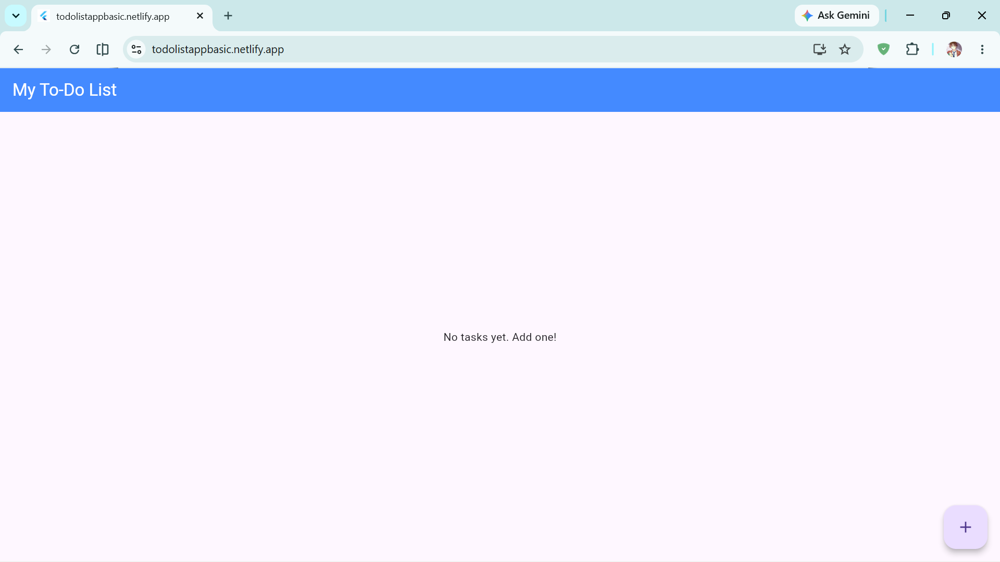
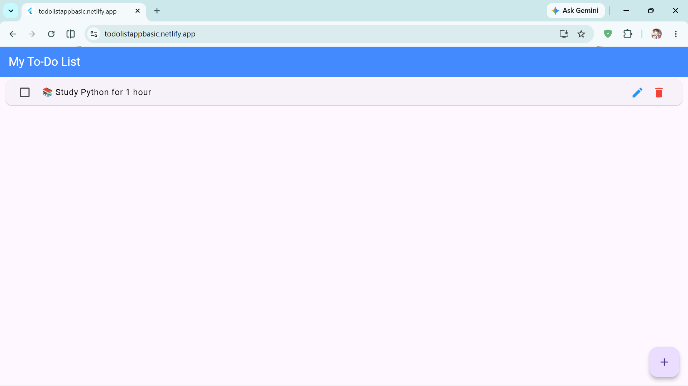
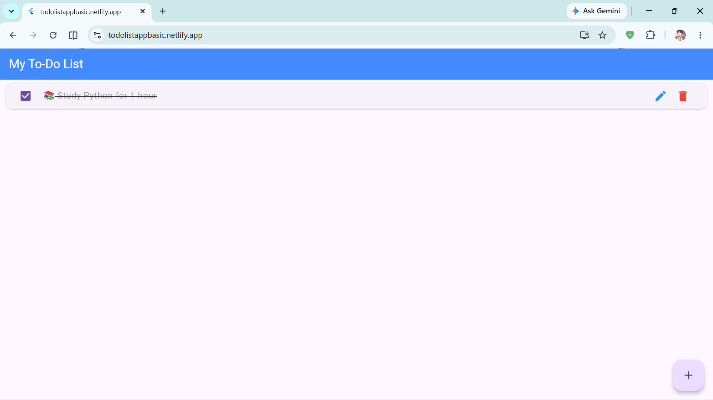

<div align="center">

# ✅ Flutter Todo App

### A sleek, minimal, and fully functional task management app built with Flutter

[](https://flutter.dev)
[](https://dart.dev)
[](LICENSE)
[]()
[](https://todolistappbasic.netlify.app/)
[](https://github.com/LAKSHMANAN-O7O5/flutter-todo-app/pulls)

<br/>


&nbsp;

&nbsp;


<br/><br/>

[](https://todolistappbasic.netlify.app/)

</div>

---

## 📸 Screenshots

<div align="center">

| Empty State | Task Added | Task Completed |
|:-----------:|:----------:|:--------------:|
|  |  |  |

</div>

---

## ⚡ Features

| Feature | Description |
|---------|-------------|
| ➕ **Create Tasks** | Quickly add new tasks with a clean dialog interface |
| ✏️ **Edit Tasks** | Modify existing task titles on the fly |
| 🗑️ **Delete Tasks** | Remove tasks you no longer need |
| ✅ **Mark Complete** | Toggle tasks as done with a checkbox — completed tasks get a strikethrough effect |
| 💾 **Persistent Storage** | Tasks are saved locally using `SharedPreferences` — they survive app restarts |
| 🎨 **Material Design** | Beautiful Material Design 3 UI with a polished look and feel |
| 📱 **Cross-Platform** | Runs on Android, iOS, Web, Windows, macOS, and Linux |

---

## 🛠️ Tech Stack

<div align="center">

| Technology | Purpose |
|:----------:|:-------:|
|  | UI Framework |
|  | Programming Language |
|  | Design System |
|  | Local Storage |

</div>

---

## 🚀 Getting Started

### Prerequisites

- [Flutter SDK](https://docs.flutter.dev/get-started/install) (≥ 3.29)
- [Dart SDK](https://dart.dev/get-dart) (≥ 3.9.2)
- Android Studio / VS Code with Flutter extension
- An emulator or physical device

### Installation

```bash
# 1. Clone the repository
git clone https://github.com/LAKSHMANAN-O7O5/flutter-todo-app.git

# 2. Navigate to the project directory
cd flutter-todo-app

# 3. Install dependencies
flutter pub get

# 4. Run the app
flutter run
```

### Run on Specific Platforms

```bash
# Android
flutter run -d android

# iOS
flutter run -d ios

# Chrome (Web)
flutter run -d chrome

# Windows
flutter run -d windows
```

---

## 📁 Project Structure

```
flutter-todo-app/
├── lib/
│   └── main.dart          # App entry point & TodoScreen widget
├── android/               # Android platform files
├── ios/                   # iOS platform files
├── web/                   # Web platform files
├── windows/               # Windows platform files
├── linux/                 # Linux platform files
├── macos/                 # macOS platform files
├── test/                  # Unit & widget tests
├── pubspec.yaml           # Dependencies & project config
├── analysis_options.yaml  # Lint rules
└── README.md              # You are here!
```

---

## 📦 Dependencies

| Package | Version | Purpose |
|---------|---------|---------|
| [`shared_preferences`](https://pub.dev/packages/shared_preferences) | ^2.2.2 | Persistent key-value local storage |
| [`cupertino_icons`](https://pub.dev/packages/cupertino_icons) | ^1.0.8 | iOS-style icons |

---

## 🤝 Contributing

Contributions are welcome! Here's how you can help:

1. **Fork** the repository
2. **Create** a feature branch (`git checkout -b feature/amazing-feature`)
3. **Commit** your changes (`git commit -m 'Add amazing feature'`)
4. **Push** to the branch (`git push origin feature/amazing-feature`)
5. **Open** a Pull Request

---

## 📄 License

This project is licensed under the **MIT License** — see the [LICENSE](LICENSE) file for details.

---

## 🙏 Acknowledgments

- [Flutter](https://flutter.dev) — Google's UI toolkit for building natively compiled apps
- [pub.dev](https://pub.dev) — Dart & Flutter package repository
- [Shields.io](https://shields.io) — Beautiful badges for README files

---

<div align="center">

**Made with ❤️ and Flutter**

[](https://github.com/LAKSHMANAN-O7O5)

</div>
